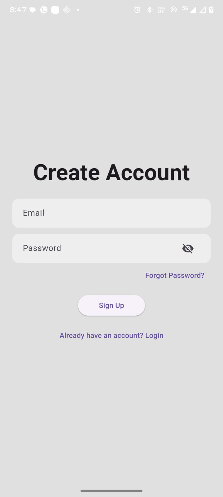
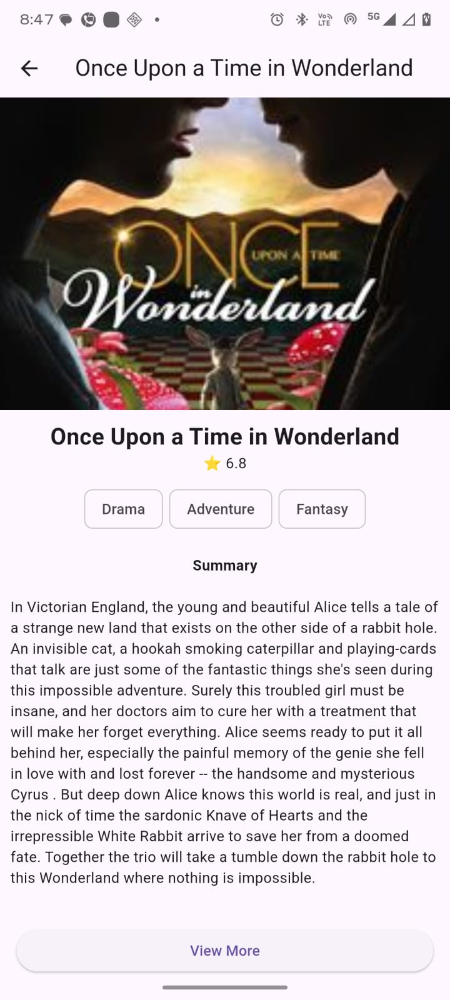
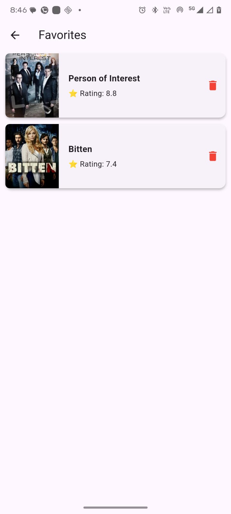
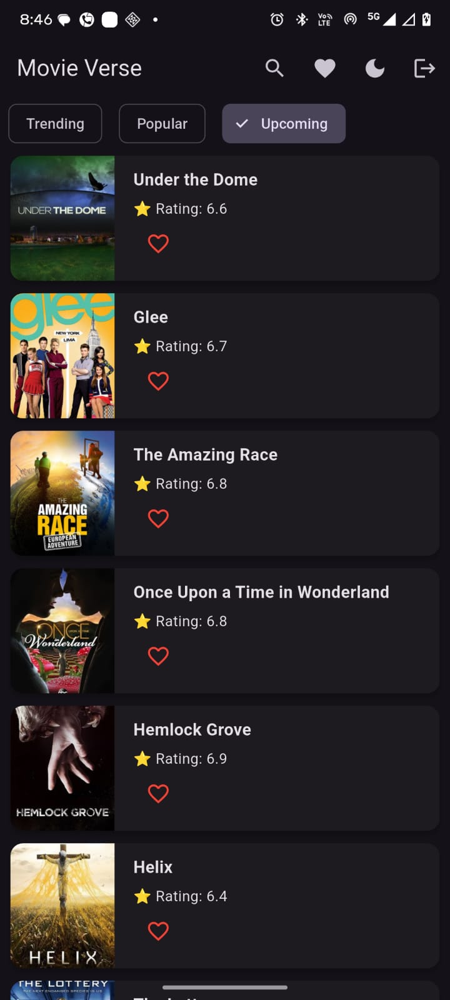
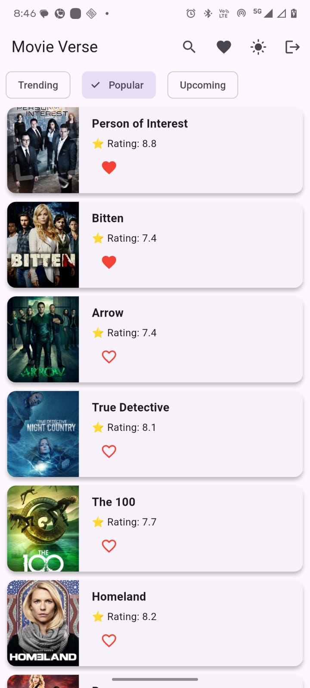
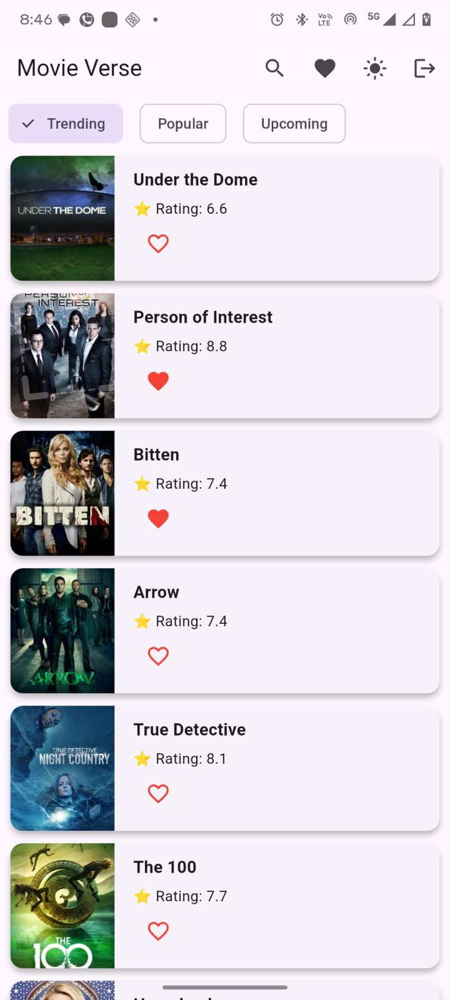
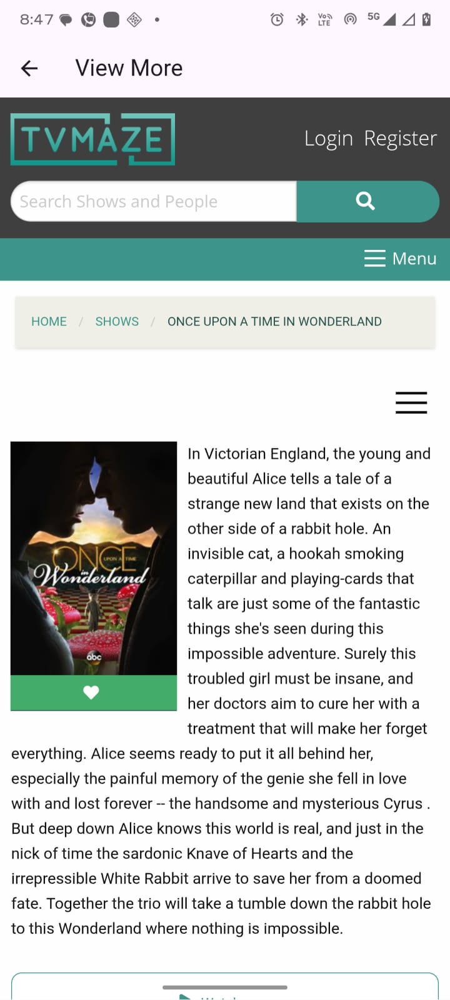
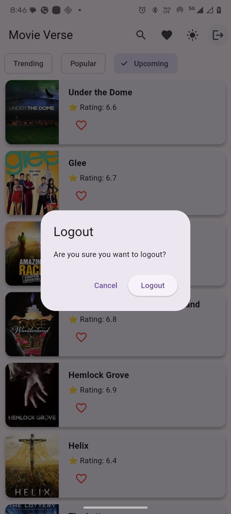

# Movie Verse

A Flutter-based movie browsing application featuring API integration, Provider state management, authentication, and Hive local storage.

---

## Features

- Search movies and TV shows
- Trending and popular movies
- Favorites management
- User authentication
- Dark and light theme support
- Local storage using Hive
- Responsive and clean UI
- Fast API data fetching

---

## Tech Stack

- Flutter
- Dart
- Provider
- Hive
- REST API

---

## Screenshots

### Splash Screen

### Login Screen

### Signup Screen

### Search Bar Screen

### Movie Info Screen

### Favourite Screen

### Dark Theme Screen

### Filter Popular Screen

### Filter Trending Screen

### View More Screen

### Logout Popup Screen

